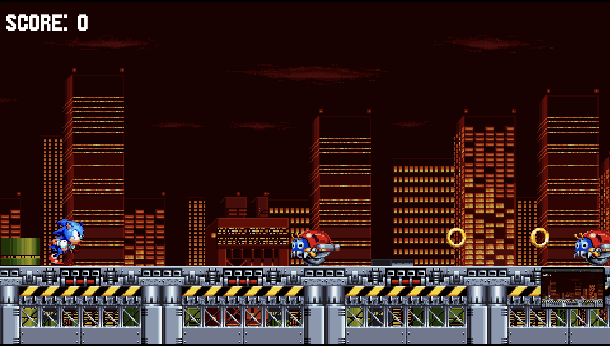
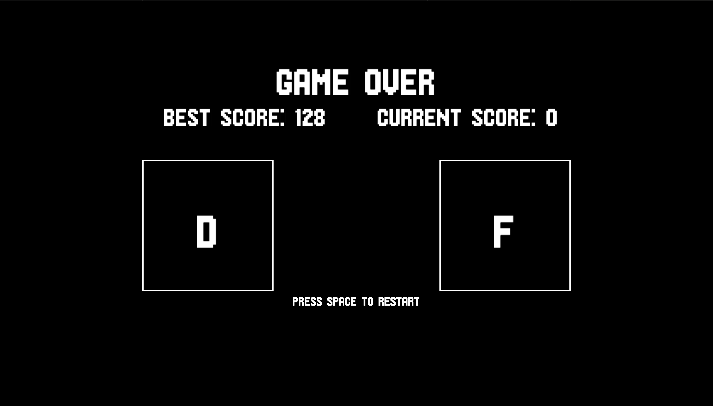
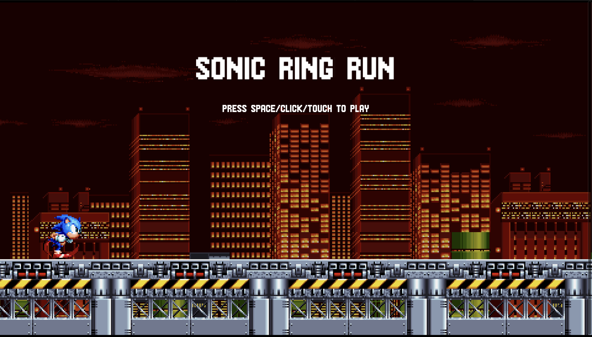
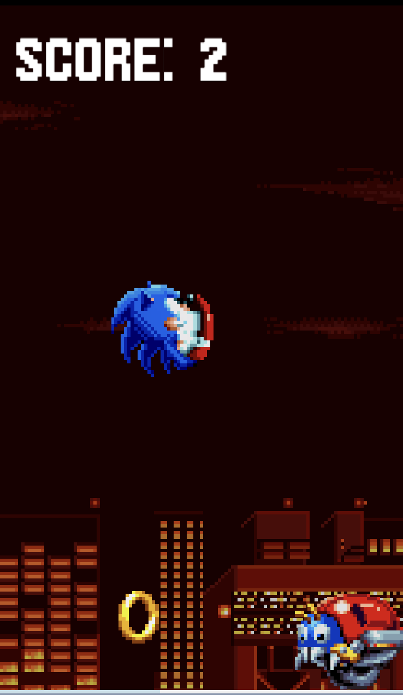
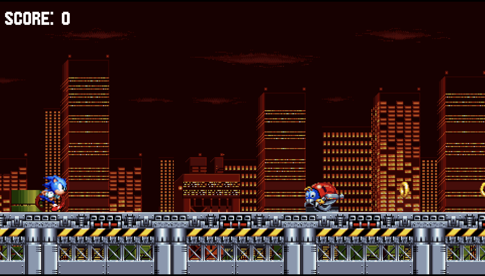

# Sonic Gamer 🎮

A modern web-based Sonic game built with Vite and KaPlay, bringing the classic hedgehog's adventures to your browser with modern JavaScript technologies.

![Game Title Screen]
*Screenshot showcasing the game's title screen with Sonic's character and the game logo against a dynamic background*

## 🌟 Features

### Classic Sonic Gameplay
- Smooth and responsive controls
- Physics-based movement system
- Classic Sonic running, jumping, and spinning mechanics



### Level Design
- Multiple uniquely designed levels
- Classic Sonic-style environments
- Collectible rings and killable enemies
- Various obstacles and enemies

### Game Mechanics
- Ring collection system
- Enemy interaction
- Power-up system

## 🛠️ Technical Stack
- Built with Vite 6.3.5
- Powered by KaPlay 3001.0.0-alpha.21
- Modern JavaScript
- Node.js with NPM package management

## 🎮 Controls
- **Arrow Keys**: Move Sonic left/right
- **Space Bar**: Jump
- **Down + Space**: Spin Dash
- **S Key**: Special Move

![Controls Display]
*Screenshot showing the in-game controls menu or tutorial screen*

## 🚀 Getting Started

### Prerequisites
- Node.js (Latest LTS version recommended)
- NPM (Comes with Node.js)

### Installation
1. Clone the repository:
```bash
git clone [repository-url]
```

2. Install dependencies:
```bash
   npm run dev
```

3. Start the development server:
```bash
npm run dev
```

4. Build for production:
```bash
npm run build
```

### Score System
- Points for collecting rings and killing mobs
- High score tracking



### Sound Effects & Music
- Classic Sonic sound effects
- Dynamic background music
- Interactive audio feedback

## 🛠️ Development
This project uses:
- Vite for fast development and optimized builds
- KaPlay for game engine functionality
- Modern JavaScript features
- Asset optimization for web deployment

## Screenshots from the game





